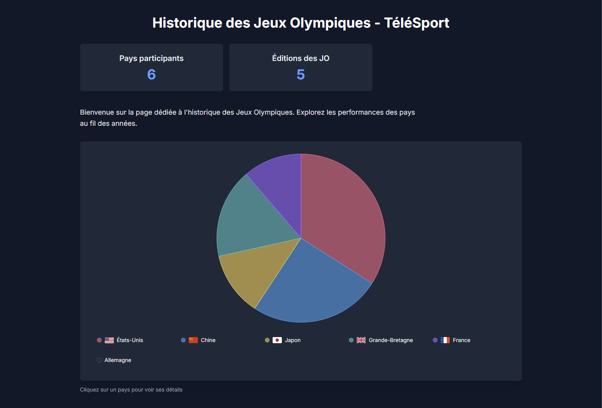
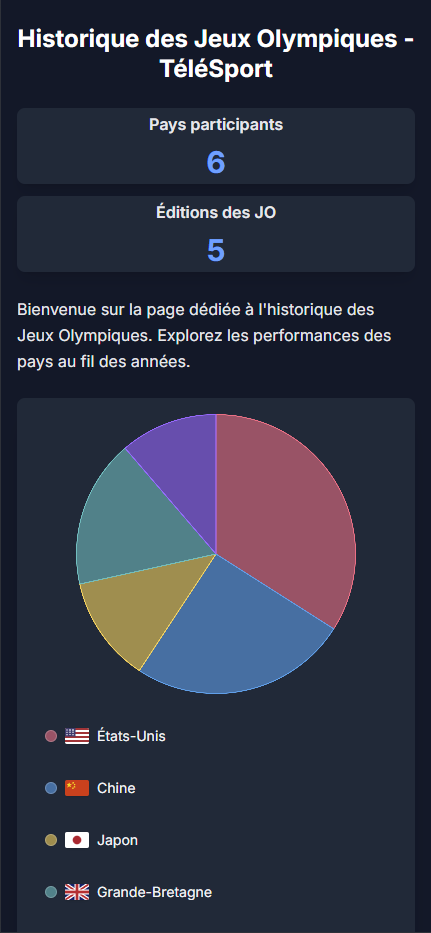
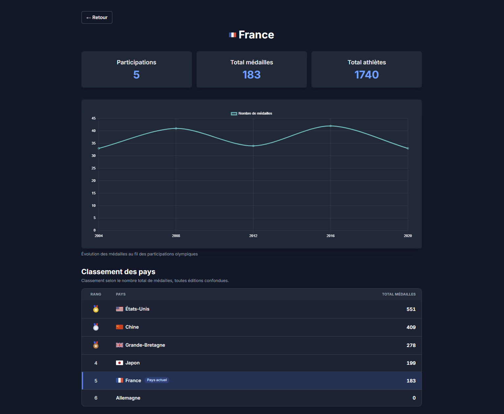
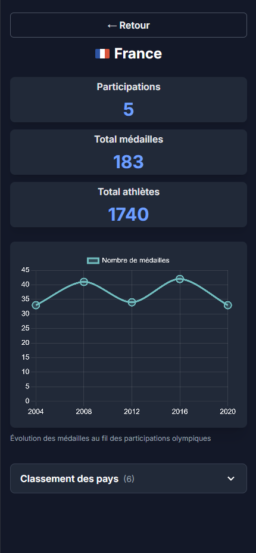

# TéléSport - Olympic Games Dashboard

Application React permettant de visualiser les performances de plusieurs pays aux Jeux Olympiques à partir de données simulées.

Le projet a été refactorisé afin de séparer clairement les pages, les composants d'interface, la gestion des données et les modèles TypeScript.

## Fonctionnalités

- Dashboard avec vue globale des médailles par pays
- Graphiques interactifs avec Chart.js
- Navigation vers une page de détail pour chaque pays
- Affichage des participations, du nombre total de médailles et du nombre total d'athlètes
- Graphique d'évolution des médailles par édition
- Classement général des pays avec mise en avant du pays consulté
- Navigation directe entre les pays depuis le classement
- Pages dédiées aux routes inconnues, aux identifiants de pays invalides et aux données indisponibles
- Affichage responsive desktop, tablette et mobile
- Interactions adaptées au tactile sur les graphiques
- État de chargement simulé avant l'affichage des données
- Données simulées centralisées dans un hook `useData`
- Typage TypeScript sans `any`

## Prérequis

- Node.js 22 LTS ou supérieur
- npm

## Installation

Cloner le dépôt :

```bash
git clone https://github.com/Furax420/2026_P2
cd 2026_P2
```

Installer les dépendances :

```bash
npm install
```

## Lancer le projet

### Développement

```bash
npm run dev
```

L'application est ensuite disponible par défaut sur :

```text
http://localhost:5173
```

### Build de production

```bash
npm run build
```

### Lint

```bash
npm run lint
```

### Prévisualisation du build

Après avoir exécuté `npm run build` :

```bash
npm run preview
```

## Architecture du projet

```text
src/
├── app/
│   ├── components/          # Composants UI réutilisables et graphiques
│   ├── hooks/
│   │   └── useData.ts       # Données simulées et état de chargement
│   ├── models/              # Interfaces et types TypeScript
│   └── pages/
│       ├── DashboardPage.tsx
│       ├── CountryDetailPage.tsx
│       ├── InvalidCountryPage.tsx
│       ├── DataUnavailablePage.tsx
│       └── NotFoundPage.tsx
├── App.tsx             # Routing principal
├── main.tsx            # Point d'entrée React
└── index.css           # Styles globaux
```

Le découpage repose sur une séparation simple des responsabilités :

- `components/` contient les composants réutilisables et principalement orientés affichage ;
- `pages/` contient les pages de l'application et orchestre les données nécessaires à l'affichage ;
- `hooks/` centralise l'accès aux données simulées via `useData` ;
- `models/` contient les interfaces TypeScript utilisées dans l'application.

Une description plus complète est disponible dans [`ARCHITECTURE.md`](./ARCHITECTURE.md).

## Navigation

Routes principales :

```text
/               Dashboard
/country/:id    Détail d'un pays
/404            Page non trouvée
```

Une URL inconnue est redirigée vers `/404`. Sur `/country/:id`, un identifiant invalide ou inexistant affiche une page dédiée sans laisser l'utilisateur sur un écran vide. Un pays connu dont les participations sont absentes affiche quant à lui un état « données indisponibles ».

## Données

L'application utilise actuellement des données simulées déclarées en TypeScript.

La récupération des données est centralisée dans le hook :

```text
src/app/hooks/useData.ts
```

Ce choix permet aux pages de ne pas dépendre directement de la source des données. Le hook pourra donc être remplacé ou adapté plus tard pour utiliser une API réelle sans avoir à reprendre toute l'interface.

Un délai de 500 ms simule une récupération asynchrone et permet de vérifier l'état de chargement. L'entrée « Allemagne » ne contient volontairement aucune participation : elle sert à tester le cas où un identifiant de pays existe, mais où les données nécessaires à la page détail sont manquantes.

## Responsive

L'interface a été adaptée pour fonctionner sur :

- desktop ;
- tablette ;
- téléphone.

Sur les écrans plus petits, certaines parties de l'interface sont réorganisées pour conserver une bonne lisibilité. Le classement des pays est notamment affiché dans une section repliable sur mobile et tablette.

Les points du graphique d'évolution disposent également d'une zone tactile élargie afin de faciliter leur utilisation sur téléphone.

## Captures d'écran

Les captures suivantes documentent les deux pages principales dans les formats desktop et mobile.

### Dashboard

#### Desktop



#### Mobile



### Page détail d'un pays

#### Desktop



#### Mobile



## Stack technique

- React 19
- TypeScript
- Vite
- Tailwind CSS
- React Router
- Chart.js
- ESLint

## Documentation

- [`ARCHITECTURE.md`](./ARCHITECTURE.md) : organisation et choix d'architecture
- [`notes-architecture.md`](./notes-architecture.md) : notes d'analyse et de refactorisation du starter

## Limites connues

- Les données sont simulées localement : il n'y a ni API, ni authentification, ni persistance côté serveur.
- Le modèle fournit un total de médailles par participation, sans ventilation entre or, argent et bronze.
- Le chargement réseau est simulé avec un délai fixe de 500 ms.
- L'entrée « Allemagne » est un cas de test volontaire pour l'état « données indisponibles » et ne contient aucune participation.
- Aucun test automatisé n'est attendu dans le périmètre de cet exercice ; les parcours et les tailles d'écran sont vérifiés manuellement.

## Contexte

Projet réalisé dans le cadre d'un exercice de refactorisation et de développement front-end React.

L'objectif principal était de reprendre un starter existant, améliorer sa maintenabilité, appliquer une architecture plus claire et compléter l'expérience utilisateur tout en conservant des données simulées.
